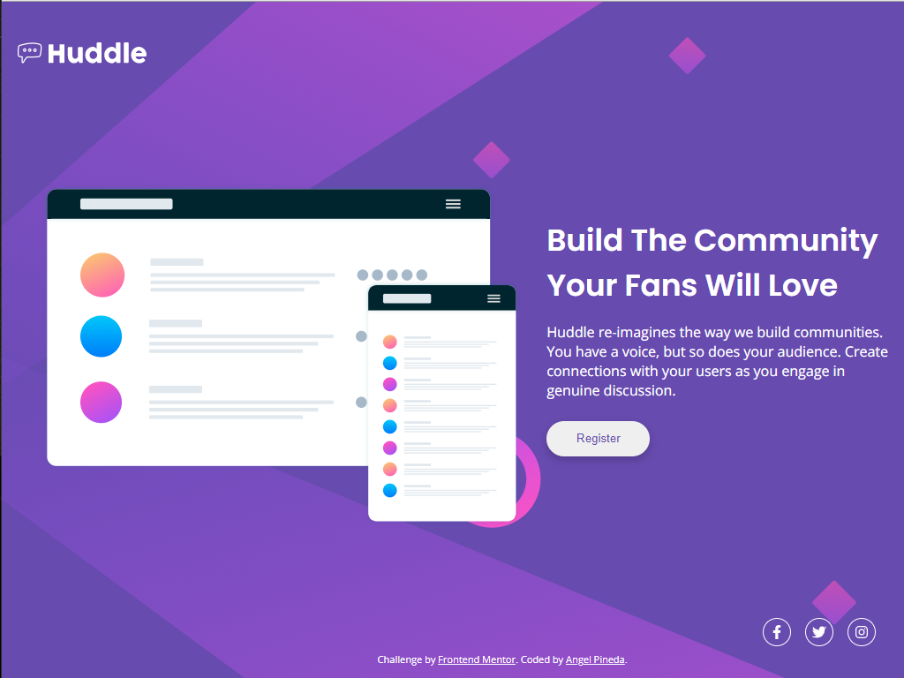

# Frontend Mentor - Huddle landing page with single introductory section solution

This is a solution to the [Huddle landing page with single introductory section challenge on Frontend Mentor](https://www.frontendmentor.io/challenges/huddle-landing-page-with-a-single-introductory-section-B_2Wvxgi0). Frontend Mentor challenges help you improve your coding skills by building realistic projects. 

## Table of contents

- [Overview](#overview)
  - [The challenge](#the-challenge)
  - [Screenshot](#screenshot)
  - [Links](#links)
- [My process](#my-process)
  - [Built with](#built-with)
  - [What I learned](#what-i-learned)
  - [Continued development](#continued-development)
- [Author](#author)

**Note: Delete this note and update the table of contents based on what sections you keep.**

## Overview

### The challenge

Users should be able to:

- View the optimal layout for the page depending on their device's screen size
- See hover states for all interactive elements on the page

### Screenshot

This is a preview of my result.

### Links

- Solution URL: [Visit](https://www.frontendmentor.io/solutions/hubble-landing-page-html-css-flex-mrLrglcar)
- Live Site URL: [Visit](https://aocelopilli.github.io/frontendMentor-huddleLandingPage/)

## My process

### Built with

- Semantic HTML5 markup
- CSS custom properties
- Flexbox
- Mobile-first workflow

### What I learned

I need to define better which tool I'll use.

### Continued development

Keep practicing with layouts

## Author

+ Website - [www.angelpineda.com.mx](https://www.angelpineda.com.mx)
+ Frontend Mentor - [@angelp495](https://www.frontendmentor.io/profile/angelp495)
+ Twitter - [@AOcelopilli](https://twitter.com/AOcelopilli)